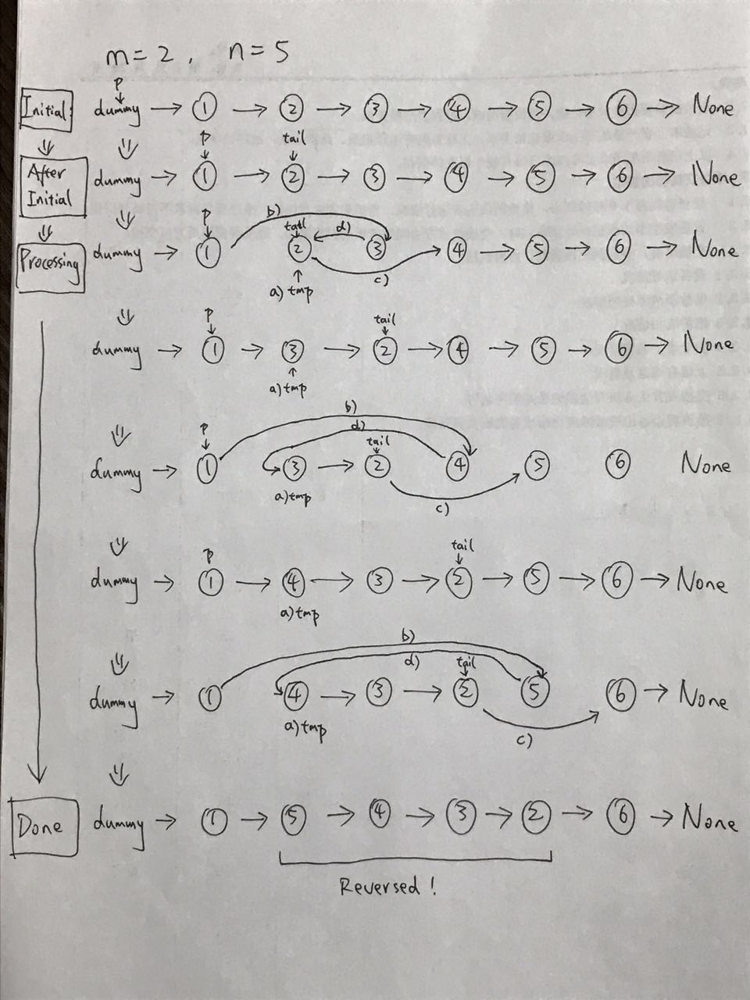

# Reverse Linked List II
[leetcode.com/problems/reverse-linked-list-ii/description/](https://leetcode.com/problems/reverse-linked-list-ii/description/)
Reverse a linked list from position m to n. Do it in one-pass.

Note: 1 ≤ m ≤ n ≤ length of list.

Example:
```
Input: 1->2->3->4->5->NULL, m = 2, n = 4
Output: 1->4->3->2->5->NULL
```

[Diagram Ref](https://leetcode.com/problems/reverse-linked-list-ii/discuss/30709/Talk-is-cheap-show-me-the-code-(and-DRAWING))
